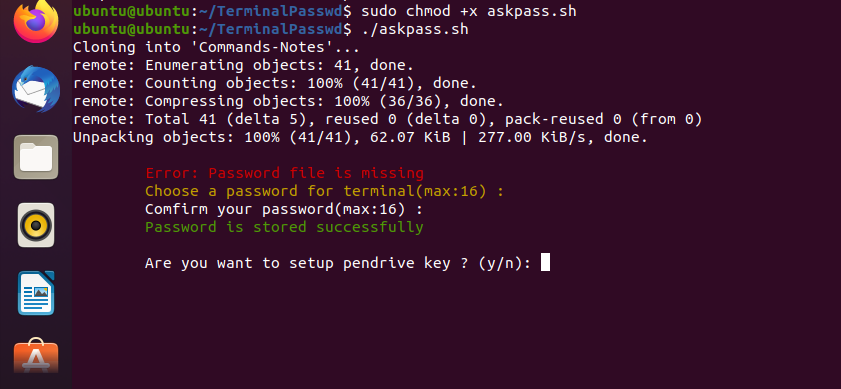

# 🔐 TerminalPasswd (Login to Terminal Window)

A secure and intelligent terminal login system with password protection and automatic login capabilities using USB, Bluetooth, or Wi-Fi device detection.

## 🚀 Features

* 🔒 **Secure Password Protection**: Enforces terminal login only after password validation.
* 🔌 **Auto-login via USB Device**: Automatically logs in when a specific USB device is connected.
* 📶 **Auto-login via Bluetooth**: Logs in when a trusted Bluetooth device is nearby.
* 🌐 **Auto-login via Wi-Fi**: Enables login when connected to a trusted Wi-Fi network.
* 📄 **Log Management**: All login activities are logged for auditing.
* 🧪 **Compatibility**: Works on Linux systems with basic shell and `systemd` capabilities.

## 🛠️ Requirements

* Linux-based OS (e.g., Ubuntu, Manjaro Debian, Arch) Genome- Desktop based only
* Shell : `bash`/`zsh`
* `bluetoothctl`, `rfkill`, and `hciconfig` (for Bluetooth)
* `nmcli` (for Wi-Fi)
* `udevadm` (for USB detection)
* `systemd` (to set up the login service)
* `git` (to clone the repository)
* And make sure those listed commands are installed in your system: `md5sum, grep, cat, echo, tr, ffmpeg, ip, awk, read, cut, ps, iwlist, sleep, clear, trap, wc, chmod, ls, upower, pgrep, date, free, curl, mkdir git`

## 📦 Installation

1. **Clone this repository**:

   ```bash
   git clone https://github.com/Bibhas-Das/TerminalPasswd.git
   cd TerminalPasswd
   ```

2. **Copy the file autoexecute.desktop to ~/.config/autorun/**:
   
   ```bash
    mkdir -p ~/.config/autorun && cp autoexecute.desktop ~/.config/autorun/ 
   ```
   
3. **Then just run the askpass.sh file**:

   ```bash
   sudo chmod +x askpass.sh
   ./askpass.sh 
   ```

## ⚙️ Usage

  


 * Here You can easily add your trusted Pendrive, Wifi , Bluetooth deivces for auto-login
 * Or use password to login 
 * Then just run 

 ```bash
 commands
 ```
 * Here all external commands you can use now. For more compatibility add blackarch database to your system.
 
## 📁 Directory Structure after setup

```
~/
 ├──.TerminalSecurity
 |    ├──login_attempts.log
 |    ├──*.png
 |    └──*.mp4
 ├──.password_hashes.csv
 ├──.Secrect
 |    ├── commands
 |    └── notes
 ├──.askpass
 └──.autolock

```

## 🛡️ Security Notice

* While convenient, auto-login methods (USB, Bluetooth, Wi-Fi) reduce security and should be used with caution in sensitive environments. Always have a fallback password login enabled.

* If Trusted device will remove, the system will be automaticly locked
* It stores all logs, In case of lock It also captures the image and short video for thread indentification

## 🗑️ Uninstall
   
   * To uninstall form your device just go to the downloaded folder or redownload the repo and inside the folder uninstall.sh file is there just run it

   ```bash
   sh uninstall.sh
   ```


## 🧑‍💻 Contributing

Contributions, issues, and suggestions are welcome! Please open an issue or submit a pull request.

## 📜 License

MIT License

Copyright (c) [2024] [Bibhas Das]

Permission is hereby granted, free of charge, to any person obtaining a copy
of this software and associated documentation files (the “Software”), to deal
in the Software without restriction, including without limitation the rights
to use, copy, modify, merge, publish, distribute, sublicense, and/or sell
copies of the Software, and to permit persons to whom the Software is
furnished to do so, subject to the following conditions:

The above copyright notice and this permission notice shall be included in
all copies or substantial portions of the Software.

THE SOFTWARE IS PROVIDED “AS IS”, WITHOUT WARRANTY OF ANY KIND, EXPRESS OR
IMPLIED, INCLUDING BUT NOT LIMITED TO THE WARRANTIES OF MERCHANTABILITY,
FITNESS FOR A PARTICULAR PURPOSE AND NONINFRINGEMENT. IN NO EVENT SHALL THE
AUTHORS OR COPYRIGHT HOLDERS BE LIABLE FOR ANY CLAIM, DAMAGES OR OTHER
LIABILITY, WHETHER IN AN ACTION OF CONTRACT, TORT OR OTHERWISE, ARISING FROM,
OUT OF OR IN CONNECTION WITH THE SOFTWARE OR THE USE OR OTHER DEALINGS IN
THE SOFTWARE.

---
